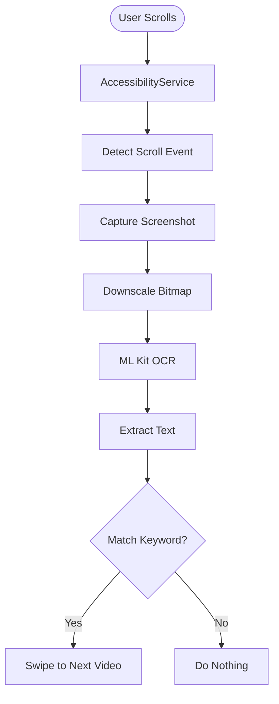
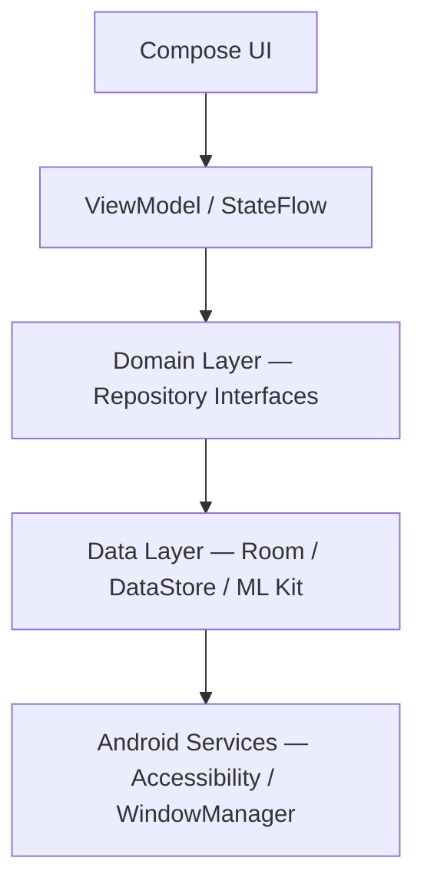
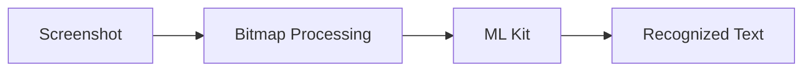
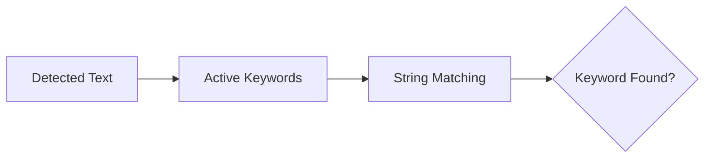
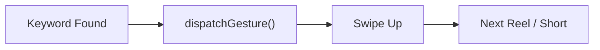
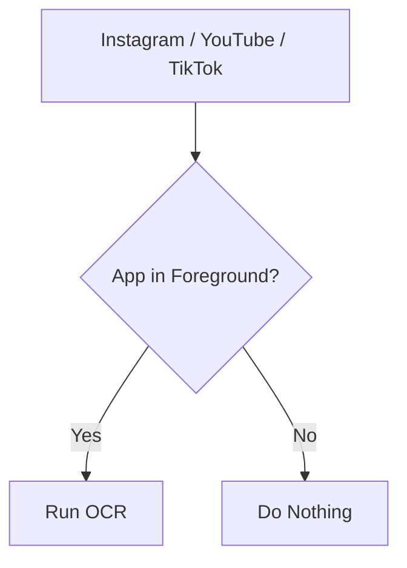
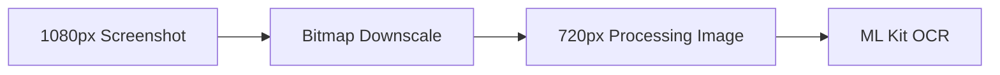

<div align="center">


# 🎬 VideoSkipper

**Automatically skip unwanted Reels & Shorts using on-device OCR.**

An Android automation app that detects user-defined keywords on short-form videos
and automatically scrolls past matching content — 100% on-device, no cloud, no data upload.

<p>
  
  
  
  
  
</p>

[Features](#-features) • [How It Works](#️-how-it-works) • [Architecture](#️-architecture) • [Installation](#-installation) • [Permissions](#-required-permissions) • [Limitations](#️-limitations)

</div>

<br/>

## 🎥 Demo

<div align="center">
  
  <p><i>VideoSkipper automatically detects unwanted content and skips it.</i></p>

  <a href="https://www.youtube.com/watch?v=w0JSiymhGUY"><strong>▶️ Watch the full demo on YouTube</strong></a>
</div>

<br/>

## 📸 Screenshots

<div align="center">
<table>
  <tr>
    <td></td>
    <td></td>
  </tr>
  <tr>
    <td></td>
    <td></td>
  </tr>
  <tr>
    <td></td>
    <td></td>
  </tr>
  <tr>
    <td></td>
    <td></td>
  </tr>
</table>
</div>

**Screen recordings:**

https://github.com/user-attachments/assets/069616eb-4ffc-4680-a73f-2359ddd4c0ae

https://github.com/user-attachments/assets/2676f585-8ca7-40f2-a467-a997b8366e7d

<p align="center"><i>VideoSkipper running on top of short-form video applications.</i></p>

---

## 📱 What is VideoSkipper?

**VideoSkipper** automatically skips short-form video content when it detects user-defined keywords on the screen.

It currently works with:

- Instagram Reels

VideoSkipper monitors the foreground screen, captures a screenshot when a genuine scroll occurs, extracts visible text using **Google ML Kit's on-device OCR**, and checks the detected text against the user's saved keywords. If a keyword matches, it automatically performs a swipe gesture to move to the next video — all processed **locally on the device**.



---

## ✨ Features

| | |
|---|---|
| 🔍 **Real-Time Detection** | Detects text appearing on Reels and Shorts using on-device OCR. |
| 🤖 **Automatic Skipping** | Automatically performs a swipe when a configured keyword is detected. |
| 💬 **Floating Bubble** | Add keywords and control detection without leaving the currently opened app. |
| 🔋 **Battery Conscious** | Uses event-based detection, foreground-app gating, bitmap optimization and automatic safeguards. |
| 🔒 **Fully On-Device** | OCR processing happens locally — screenshots are never uploaded to a server. |
| 🎛️ **Independent Controls** | Text and image detection can be toggled independently. |

---

## 🏗️ Architecture

VideoSkipper follows a **Clean Architecture + MVVM** approach with clear separation between presentation, domain logic, and data sources.

```text
VideoSkipper
│
├── presentation
│   ├── screens
│   ├── components
│   └── floating overlay UI
│
├── viewmodel
│   ├── MonitoringViewModel
│   └── TextViewModel
│
├── domain
│   └── repository
│       ├── KeywordRepository
│       ├── MonitoringRepository
│       ├── AutoScrollDetectionRepository
│       └── ScreenActionController
│
├── data
│   └── repository
│       ├── Room-backed repositories
│       ├── DataStore-backed repositories
│       └── ML Kit-backed repositories
│
├── service
│   ├── PizzaDetectorAccessibilityService
│   └── OverlayService
│
└── di
    ├── DatabaseModule
    └── RepositoryModule
```

**Layer flow:**



---

## 🛠️ Tech Stack

| Category | Technology |
|---|---|
| Language | Kotlin |
| UI | Jetpack Compose |
| Design | Material 3 |
| Architecture | Clean Architecture + MVVM |
| Dependency Injection | Hilt |
| Local Database | Room |
| Preferences | DataStore |
| Concurrency | Kotlin Coroutines |
| Reactive State | Kotlin Flow / StateFlow |
| OCR | Google ML Kit Text Recognition |
| Screen Capture | AccessibilityService `takeScreenshot()` |
| Automation | AccessibilityService `dispatchGesture()` |
| Overlay | `WindowManager` + `ComposeView` |
| Minimum Android Version | Android 11 / API 30 |

---

## ⚙️ How It Works

### 1 · Floating Overlay
`OverlayService` creates a draggable floating bubble using `WindowManager`. The overlay lets users add keywords, enable/disable detection, and control VideoSkipper without leaving Instagram, YouTube, or TikTok.

### 2 · Detecting Scroll Events
`PizzaDetectorAccessibilityService` listens for accessibility events generated by the watched application. Instead of reacting to every accessibility event, VideoSkipper focuses specifically on `TYPE_VIEW_SCROLLED`, which avoids unnecessary OCR triggered by:
- Video progress updates
- Caption animations
- UI changes
- Content refreshes

### 3 · Screenshot Capture
When a genuine scroll is detected, the accessibility service captures the screen via `takeScreenshot()`. The bitmap is downscaled before OCR processing to reduce memory usage and CPU consumption.

### 4 · On-Device OCR
The processed bitmap is passed to **ML Kit Text Recognition** — no cloud OCR service required.



### 5 · Keyword Matching
The recognized text is compared against the user's active keyword list, stored locally.



### 6 · Automatic Swipe
On a match, the service calls `dispatchGesture()` to perform a synthetic swipe past the current video.



---

## 🔋 Performance & Battery Engineering

Performance was a major part of the implementation.

**Event precision** — The initial implementation relied on `TYPE_WINDOW_CONTENT_CHANGED`, which fired excessively as content changed. It was replaced with `TYPE_VIEW_SCROLLED`, drastically cutting unnecessary screenshot/OCR cycles.

**Foreground-app gating** — OCR only runs when a supported app is actually in the foreground.



**Bitmap optimization** — Screenshots are downscaled before processing.



**Mutex protection** — Detection cycles are protected by a `Mutex`, preventing overlapping screenshot/OCR operations when scroll events fire rapidly.

**Automatic safety stop** — A **6-hour automatic stop safeguard** prevents an unattended accessibility session from continuously draining battery.

---

## 🐛 Notable Bug Fix

During development, the accessibility service appeared as `Connected` / `Enabled` in Android system settings, but received **zero accessibility events**.

Inspecting the runtime `AccessibilityServiceInfo` revealed:

```text
eventTypes = 0
typeAllMask = -1
```

The service configuration was never actually applied — the root cause was a one-character typo in the manifest metadata key.

| | Metadata Key |
|---|---|
| ❌ Incorrect | `android:name="android.accessibility.service"` |
| ✅ Correct | `android:name="android.accessibilityservice"` |

Android silently ignored the incorrect key, breaking the entire event-processing pipeline.

---

## 🚀 Getting Started

### Requirements

- Android Studio
- Kotlin
- Android SDK
- A **physical Android device** (required — the app depends on Accessibility APIs and `takeScreenshot()`, which don't behave reliably on emulators)
- Android 11 / API 30 or higher

---

## 📦 Installation

```bash
# 1. Clone the repository
git clone https://github.com/mohitdamke/VideoSkipper.git

# 2. Open the project in Android Studio
# 3. Let Gradle sync and build
# 4. Run on a physical Android 11+ device
```

---

## 🔐 Required Permissions

VideoSkipper needs special Android permissions to interact with other apps.

| Permission | Path | Why |
|---|---|---|
| **Display over other apps** | `Settings → Apps → Special app access → Display over other apps → VideoSkipper → Allow` | Powers the floating overlay bubble |
| **Accessibility Service** | `Settings → Accessibility → Installed / Downloaded apps → VideoSkipper → Enable` | Detects scrolls, captures screenshots, and performs swipes |
| **Restricted settings (Android 13+, sideloaded installs)** | `App Info → ⋮ → Allow Restricted Settings` | Required before Accessibility can be enabled on sideloaded builds |

---

## ⚠️ Limitations

- Requires **Android 11 / API 30+**
- OCR accuracy depends on text visibility, size, contrast, and styling
- Highly stylized or animated text may not be detected
- Current keyword matching is substring-based
- Accessibility-based automation apps may face Google Play policy restrictions
- Image detection UI exists, but the full image-detection pipeline isn't implemented yet
- Continuous screen analysis can still consume battery despite optimization

---

## 🔒 Privacy

VideoSkipper is built around **on-device processing**. The OCR pipeline never uploads screenshots to a remote server, and captured screen content is not intentionally persisted to disk as part of the detection pipeline.

> ⚠️ Accessibility services have powerful capabilities on Android. Only enable VideoSkipper if you understand and trust the permissions being granted.

---

## 📂 Project Highlights

<table>
<tr>
<td valign="top" width="33%">

**Android Fundamentals**
- Jetpack Compose
- Material 3
- WindowManager overlays

</td>
<td valign="top" width="33%">

**Architecture**
- Clean Architecture
- MVVM
- Hilt Dependency Injection

</td>
<td valign="top" width="33%">

**Systems & Performance**
- Accessibility Services
- `takeScreenshot()` / `dispatchGesture()`
- ML Kit OCR
- Bitmap optimization
- Concurrency control (Coroutines, Flow, Mutex)
- Battery-conscious background processing

</td>
</tr>
</table>

---

## 📄 License

This project currently does not specify a license. If you plan to open-source the repository, consider adding **MIT** or **Apache-2.0**.

---

<div align="center">

### 👨‍💻 Author

**Mohit Damke**
Android Developer

<br/>

Made with ❤️ using Kotlin & Android

**🎬 VideoSkipper — Scroll less. See what you want.**

</div>
